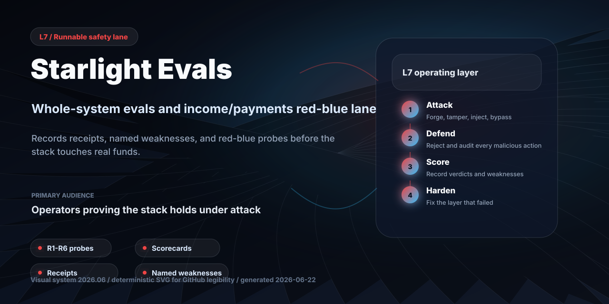
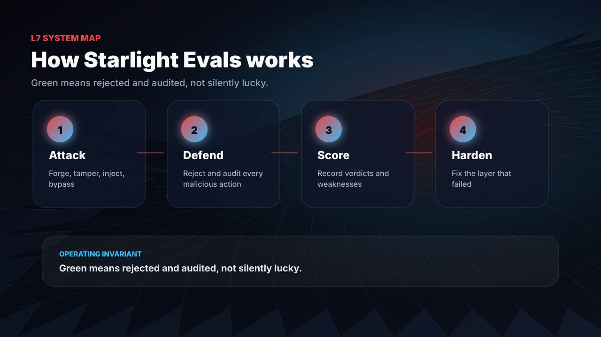
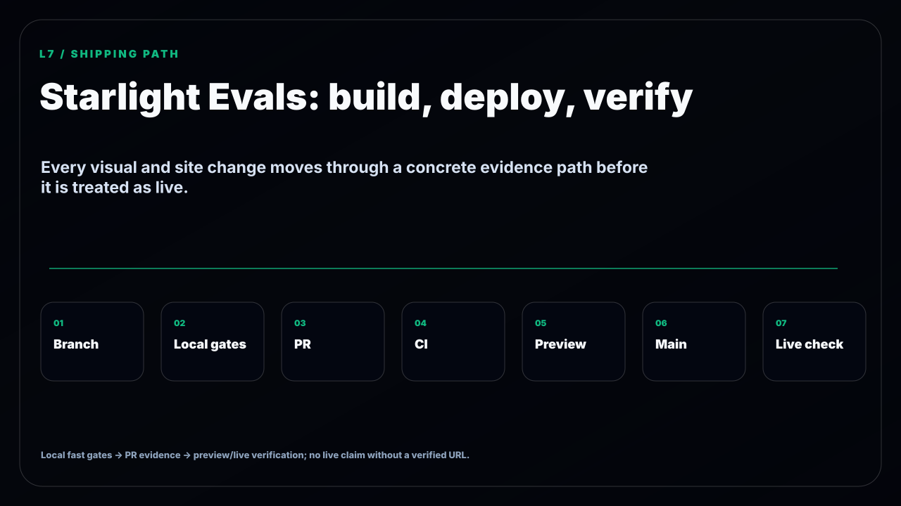

<!-- GITHUB_VISUALS_START -->
<p align="center">
  
</p>

<details open>
<summary><strong>How this repo works</strong></summary>
<p align="center">
  
</p>
</details>

<details>
<summary><strong>Build, deploy, verify path</strong></summary>
<p align="center">
  
</p>
</details>

<!-- GITHUB_VISUALS_END -->

# Starlight Evals

> Whole-system evaluation for the [Starlight Intelligence System](https://github.com/frankxai/Starlight-Intelligence-System) — models, memory, retrieval, harness, substrate, and datasets — with receipts, named weaknesses, and a cadence. Built on SIP.

[](https://github.com/frankxai/starlight-evals/actions/workflows/ci.yml)
[](LICENSE)
[](https://github.com/frankxai/Starlight-Intelligence-System)
[](#this-repo-is-a-mirror-not-the-origin)
[](CONTRIBUTING.md)

**Last run: 2026-06-10 · Next run due: 2026-07-10 · Status: 🟢 current**
*(If the next-run date is in the past, this surface is STALE and the numbers below are no longer trustworthy. Staleness is shown, never hidden.)*

---

## 90-second start

Use this repo when you want to inspect the published Starlight scorecards, fork the eval discipline for your own system, or run the mechanical red/blue lane locally.

```bash
git clone https://github.com/frankxai/starlight-evals.git
cd starlight-evals
npm run validate
# Optional: runs any cross-repo probes it can find and exits nonzero on a real defense failure.
npm run probe
```

Start with:

| I want to... | Start with |
|---|---|
| Understand the scoring contract | [`SPEC.md`](SPEC.md) |
| Inspect the latest system result | [`scorecards/2026-06-10-system-eval-v0.1.json`](scorecards/2026-06-10-system-eval-v0.1.json) |
| Trace which lanes compose the score | [`lanes.json`](lanes.json) |
| Validate published JSON receipts | `npm run validate` |
| Run the current adversarial probe | `npm run probe` |
| Publish my own scorecard | [`CONTRIBUTING.md`](CONTRIBUTING.md) |

Requirements: Node.js 22+ for the local harness scripts. No database, server, or private Starlight infrastructure is required for receipt validation. The adversarial probe degrades absent cross-repo dependencies to `PENDING`; if it finds a real checked defense failure, `STOP` and a nonzero exit are expected.

---

## ⚠️ This repo is a mirror, not the origin

The canonical source of truth is the [Starlight Intelligence System](https://github.com/frankxai/Starlight-Intelligence-System) repo under `tools/proving-ground/` and `tools/arena/`. This repo **publishes copies** of the scorecards and round receipts so they can be read, cited, and forked without the full substrate. Open issues about methodology there, not here.

## Why this exists

Most AI projects publish a model benchmark. Almost none publish a **whole-system** eval — their own memory recall, their harness integrity, their dataset provenance — with the weaknesses named and dated. This does. A model arena ranks models; the Proving Ground evaluates the *system the models run inside*.

It is run by evaluator agents that hold the **Luminor kernel mindset** — Precision (every number traces to a receipt), Wisdom (name the weakness the green tests hide), Transcendence (propose the experiment that would falsify the system's self-image). Verdicts render through the Starlight Board (PROCEED / REVISE / STOP).

## The lanes

| Lane | Measures |
|---|---|
| **Model** | capability + instruction compliance + behavioral safety of models in-harness |
| **Memory** | recall@k, precision@10, latency |
| **Retrieval** | BM25/FTS5 ranking quality |
| **Harness** | trust-contract + privacy + provenance integrity |
| **Substrate** | symmetry invariants (docs↔code, registry coverage) |
| **Datasets** | provenance + labeling honesty (no synthetic benchmarks) |
| **System** | the unifying scorecard + Overseer synthesis |
| **Income & Payments Safety** (red/blue) | whether the income & payment stack rejects-and-audits 6 adversarial attack classes (R1–R6) — the L7 assurance lane *(v0.1, PENDING)* |

## Latest scorecard — 2026-06-10 (v0.1)

System verdict: **PROCEED-WITH-REVISE**

| Lane | Verdict | Headline | Named weakness |
|---|---|---|---|
| Model | PROCEED | parity + Fable 3 / Opus 2 on stress | no cross-family judge; no agentic task |
| Memory | REVISE | **precision@10 = 0.20** | weakest number; no cross-session recall |
| Retrieval | PROCEED | recall@5 = 100% (n=10) | ceiling unearned on 10 queries |
| Harness | PROCEED | 34 pass / 0 fail / 7 todo | 7 unmeasured risk dims |
| Substrate | PROCEED | green after catching a real orphan | symmetry suite is load-bearing |
| Datasets | PROCEED | 0 synthetic benchmarks | token-overlap ground truth is soft |

On its first run, the substrate lane caught the release's own new agent sitting unregistered and flagged it. A Proving Ground that can't catch its own builder is theater. Full receipts in [`scorecards/`](./scorecards) and [`rounds/`](./rounds).

## ⚠️ Do not optimize to this score

These numbers describe the system. They are **not targets**. The moment a metric becomes something to design *toward*, it stops measuring and we retire it. Read the scorecard to understand the system's real shape — then build your own and measure it honestly. That's the whole mission: help people build their own systems, not consume someone else's leaderboard.

## Structure

```
SPEC.md         — the specification (lanes, scorecard contract, cadence, evaluator)
lanes.json      — lane registry: what each lane composes
scorecards/     — system-eval receipts + red/blue scorecards (one per run)
rounds/         — model-lane arena round receipts + red/blue probe sets
```

## Run it on your own system

The Proving Ground is a usage pattern plus a scorecard contract, not a black box. Read `SPEC.md`, point the lanes at your own infra, and run the evaluator with the kernel mindset. The harness is [Claude Code](https://claude.com/claude-code) Agent-tool model overrides — zero extra infrastructure.

**→ New here? [`CONTRIBUTING.md`](./CONTRIBUTING.md) has a "fork & run in ~10 minutes" path** and an open invitation: run the discipline on *your* stack, then open a [scorecard submission](./.github/ISSUE_TEMPLATE/scorecard-submission.md). The goal is a registry of community scorecards — people measuring their own systems honestly, not consuming ours.

---

Built on SIP — Starlight Intelligence Protocol. Code: MIT. Methodology: open.
