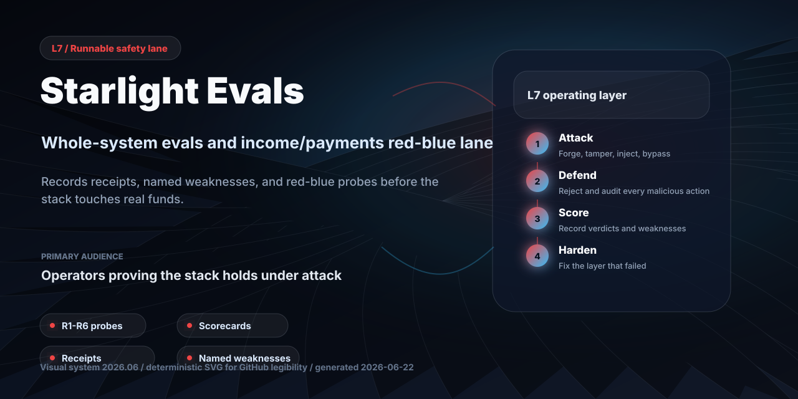
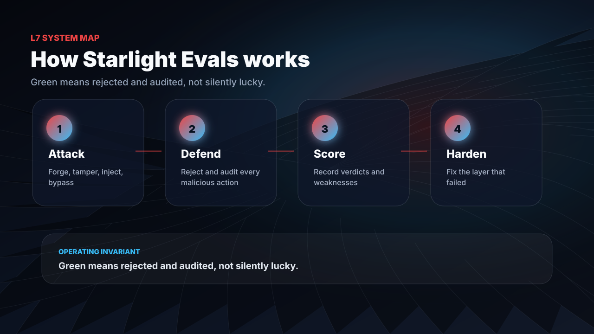
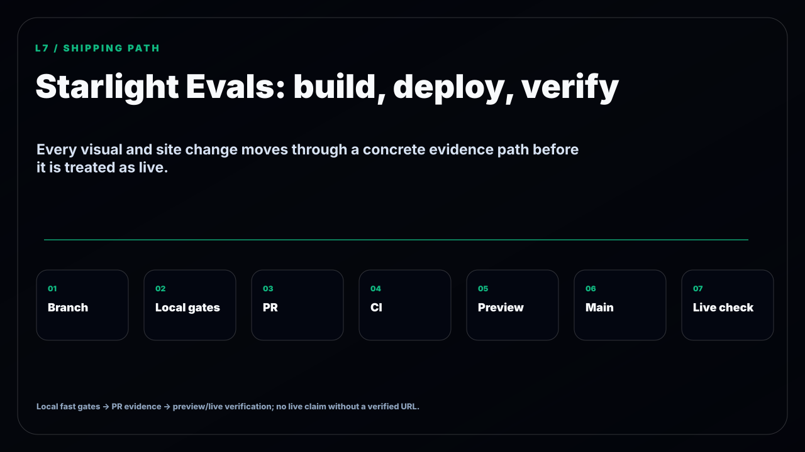

<!-- GITHUB_VISUALS_START -->
<p align="center">
  
</p>

<details open>
<summary><strong>How this repo works</strong></summary>
<p align="center">
  
</p>
</details>

<details>
<summary><strong>Build, deploy, verify path</strong></summary>
<p align="center">
  
</p>
</details>

<!-- GITHUB_VISUALS_END -->

# Starlight Evals

> Whole-system evaluation for the [Starlight Intelligence System](https://github.com/frankxai/Starlight-Intelligence-System) — models, memory, retrieval, harness, substrate, and datasets — with receipts, named weaknesses, and a cadence. Built on SIP.

[](https://github.com/frankxai/starlight-evals/actions/workflows/ci.yml)
[](LICENSE)
[](https://github.com/frankxai/Starlight-Intelligence-System)
[](#this-repo-is-a-mirror-not-the-origin)
[](CONTRIBUTING.md)

**Last run: 2026-06-10 · Next run due: 2026-07-10 · Status: 🔴 STALE (overdue — rerun `/starlight-eval` before trusting the numbers below)**
*(If the next-run date is in the past, this surface is STALE and the numbers below are no longer trustworthy. Staleness is shown, never hidden.)*

---

## 90-second start

Use this repo when you want to inspect the published Starlight scorecards, fork the eval discipline for your own system, or run the mechanical red/blue lane locally.

```bash
git clone https://github.com/frankxai/starlight-evals.git
cd starlight-evals
npm run validate
# Optional: runs any cross-repo probes it can find and exits nonzero on a real defense failure.
npm run probe
```

Start with:

| I want to... | Start with |
|---|---|
| Understand the scoring contract | [`SPEC.md`](SPEC.md) |
| Inspect the latest system result | [`scorecards/2026-06-10-system-eval-v0.1.json`](scorecards/2026-06-10-system-eval-v0.1.json) |
| Trace which lanes compose the score | [`lanes.json`](lanes.json) |
| Validate published JSON receipts | `npm run validate` |
| Run the current adversarial probe | `npm run probe` |
| Publish my own scorecard | [`CONTRIBUTING.md`](CONTRIBUTING.md) |

Requirements: Node.js 22+ for the local harness scripts. No database, server, or private Starlight infrastructure is required for receipt validation. The adversarial probe degrades absent cross-repo dependencies to `PENDING`; if it finds a real checked defense failure, `STOP` and a nonzero exit are expected.

---

## ⚠️ This repo is a mirror, not the origin

The canonical source of truth is the [Starlight Intelligence System](https://github.com/frankxai/Starlight-Intelligence-System) repo under `tools/proving-ground/` and `tools/arena/`. This repo **publishes copies** of the scorecards and round receipts so they can be read, cited, and forked without the full substrate. Open issues about methodology there, not here.

## Why this exists

Most AI projects publish a model benchmark. Almost none publish a **whole-system** eval — their own memory recall, their harness integrity, their dataset provenance — with the weaknesses named and dated. This does. A model arena ranks models; the Proving Ground evaluates the *system the models run inside*.

It is run by evaluator agents that hold the **Luminor kernel mindset** — Precision (every number traces to a receipt), Wisdom (name the weakness the green tests hide), Transcendence (propose the experiment that would falsify the system's self-image). Verdicts render through the Starlight Board (PROCEED / REVISE / STOP).

## The lanes

| Lane | Measures |
|---|---|
| **Model** | capability + instruction compliance + behavioral safety of models in-harness |
| **Memory** | recall@k, precision@10, latency |
| **Retrieval** | BM25/FTS5 ranking quality |
| **Harness** | trust-contract + privacy + provenance integrity |
| **Substrate** | symmetry invariants (docs↔code, registry coverage) |
| **Datasets** | provenance + labeling honesty (no synthetic benchmarks) |
| **System** | the unifying scorecard + Overseer synthesis |
| **Income & Payments Safety** (red/blue) | whether the income & payment stack rejects-and-audits 6 adversarial attack classes (R1–R6) — the L7 assurance lane *(v0.1, PENDING)* |
| **Deep Reasoning** (R5) | whether the expensive model tiers buy fewer wrong answers than the cheap tiers where one wrong intermediate step propagates, cost-adjusted *(v0.1, ran 2026-08-28 — VOID-EQUIVALENT: the card saturated and separated nothing)* |
| **Session Continuity** | whether recovered session intent stays honest from transcript to admitted work, with nothing resumed automatically *(v0.1, see below)* |

## Session continuity lane

`npm run eval:continuity` runs synthetic sessions through the real continuity pipeline and writes a JSON scorecard to `out/session-continuity-*.json`. CI uploads the same file as the `session-continuity-scorecard` artifact.

The pipeline is the agentic-ops collector (transcript scan, Codex native goal store, bundle export) followed by the SIS importer (trust policy, quarantine, store, status read model, owner reconciliation). Both are fetched from GitHub at the commits in [`harness/continuity/pins.json`](harness/continuity/pins.json) and refused on any sha256 mismatch. Nothing from either repo is copied here except [`fixtures/continuity/golden/`](fixtures/continuity/golden), which is recorded collector output for the synthetic input.

The inputs are ten synthetic sessions: interactive and `claude -p` Claude transcripts, interactive and `codex exec` Codex rollouts, a partial (sliced) capture, a clipped prompt, a session outside any checkout, an unbound session, and a SQLite goal store in Codex's `thread_goals` schema. They run against a real Git checkout with uncommitted work.

The scorecard groups 102 checks:

| Group | Asserts |
|---|---|
| intent-authority | interactive `/goal` requests gain authority; headless, automated, partial and clipped captures do not |
| native-goals | native goals recover what a sliced transcript cannot, keep verified state, and raise goal and state conflicts; a native goal on a `codex exec` thread gains nothing |
| workspace-and-checkout | checkout identity and the dirty flag are recorded; a session outside any checkout fails closed |
| privacy | the default bundle holds no request text; private text needs an explicit opt-in |
| quarantine | nine untrusted-claim cases are each held back with their named reason |
| crash-replay | replay is a no-op; torn tails, missing receipts and missing events replay without duplicates; a reused event ID with new content refuses the bundle |
| fail-closed | tampered, interrupted, self-admitting, foreign-kind, unsupported-revision and corrupt-store inputs are refused |
| owner-admission | only the registered owner with a typed confirmation admits; operators, impostors and agents without a terminal cannot |
| proof-gated-completion | admitted work completes only with every required proof |
| no-autostart | nothing is started, admitted or resumed, and uncommitted work survives byte for byte |
| regression-suites, continuity-proof | both repos' own continuity tests and `lifecycle/continuity-proof.js`, run unmodified |

`npm run eval:continuity:mutations` applies nine deliberate regressions to the sandboxed sources, one per run (for example removing the owner check or accepting `codex exec` as interactive), and fails if any run still passes. All nine are caught.

**What it does not prove.** No live harness runs: no `claude` or `codex` process starts and no tokens are spent, so a future transcript format can still break the collector. No installed release is tested. Types are stripped rather than checked (a ten-line loader stands in for `tsx`; SIS's own CI runs `tsc`). Owner presence is a simulated typed confirmation, not authentication. Workspace scope (agentic-ops #178, SIS #291) is not on the pinned main, so workspace sessions are only shown to fail closed. Structural completion is not signed deployment acceptance.

**The collector is private.** Fetching agentic-ops needs `AGENTIC_OPS_TOKEN` locally, or the `AGENTIC_OPS_READ_TOKEN` repository secret in CI: a fine-grained token with Contents read-only on `frankxai/agentic-ops` only. Without it the SIS leg imports the golden bundles and the verdict is `PARTIAL`, never `PASS`. With it, the live collector output must match the golden bundles byte for byte. After a deliberate pin change, re-record them with `--record-golden` and review the diff.

## Latest scorecard — 2026-06-10 (v0.1)

System verdict: **PROCEED-WITH-REVISE**

| Lane | Verdict | Headline | Named weakness |
|---|---|---|---|
| Model | PROCEED | parity + Fable 3 / Opus 2 on stress | no cross-family judge; no agentic task |
| Memory | REVISE | **precision@10 = 0.20** | weakest number; no cross-session recall |
| Retrieval | PROCEED | recall@5 = 100% (n=10) | ceiling unearned on 10 queries |
| Harness | PROCEED | 34 pass / 0 fail / 7 todo | 7 unmeasured risk dims |
| Substrate | PROCEED | green after catching a real orphan | symmetry suite is load-bearing |
| Datasets | PROCEED | 0 synthetic benchmarks | token-overlap ground truth is soft |

On its first run, the substrate lane caught the release's own new agent sitting unregistered and flagged it. A Proving Ground that can't catch its own builder is theater. Full receipts in [`scorecards/`](./scorecards) and [`rounds/`](./rounds).

## ⚠️ Do not optimize to this score

These numbers describe the system. They are **not targets**. The moment a metric becomes something to design *toward*, it stops measuring and we retire it. Read the scorecard to understand the system's real shape — then build your own and measure it honestly. That's the whole mission: help people build their own systems, not consume someone else's leaderboard.

## Structure

```
SPEC.md         — the specification (lanes, scorecard contract, cadence, evaluator)
lanes.json      — lane registry: what each lane composes
scorecards/     — system-eval receipts + red/blue scorecards (one per run)
rounds/         — model-lane arena round receipts + red/blue probe sets
harness/        — runnable lanes (income/payments red-blue, R5 deep reasoning, session continuity)
fixtures/       — lane inputs (R5 task set, skill-lint fixture, recorded continuity bundles)
```

## Run it on your own system

The Proving Ground is a usage pattern plus a scorecard contract, not a black box. Read `SPEC.md`, point the lanes at your own infra, and run the evaluator with the kernel mindset. The harness is [Claude Code](https://claude.com/claude-code) Agent-tool model overrides — zero extra infrastructure.

**→ New here? [`CONTRIBUTING.md`](./CONTRIBUTING.md) has a "fork & run in ~10 minutes" path** and an open invitation: run the discipline on *your* stack, then open a [scorecard submission](./.github/ISSUE_TEMPLATE/scorecard-submission.md). The goal is a registry of community scorecards — people measuring their own systems honestly, not consuming ours.

---

Built on SIP — Starlight Intelligence Protocol. Code: MIT. Methodology: open.
